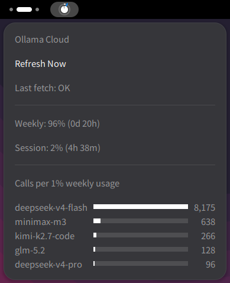

# Ollama Cloud 指示器

一个 GNOME Shell 扩展，在顶栏以紧凑的圆形指示器显示你的 [Ollama Cloud](https://ollama.com) 订阅使用量。



## 功能

- **外环** — 会话使用量（5 小时滚动窗口）
- **内圆** — 周使用量
- **指针** — 环绕外环旋转的指针，指示当前会话窗口的进度（0% 开始 → 100% 重置）
- **弹出菜单** — 点击指示器查看精确百分比及括号内距重置时间（如 `周使用量：95%（0天21小时）`）、按每1%周用量可调用次数排序的模型水平柱状图，以及手动刷新按钮
- **自动刷新** — 每 60 秒获取一次数据（可配置）
- **失败重试** — 首次获取失败时，以 1s / 2s / 4s 间隔重试 3 次

## 安装

```bash
make all
cp -r . ~/.local/share/gnome-shell/extensions/ollama-usage@lanesun.anlbrain.com/
glib-compile-schemas ~/.local/share/gnome-shell/extensions/ollama-usage@lanesun.anlbrain.com/schemas/
```

重启 GNOME Shell（Wayland 下需注销重新登录），然后启用扩展：

```bash
gnome-extensions enable ollama-usage@lanesun.anlbrain.com
```

## Cookie 设置

扩展从 `https://ollama.com/settings` 获取使用量数据，该页面需要身份验证。你需要提供 `__Secure-session` Cookie 的值。

### 如何获取 Cookie

1. 在浏览器中登录 [ollama.com](https://ollama.com)
2. 进入 **Settings** 页面（`https://ollama.com/settings`）
3. 打开浏览器开发者工具（**F12** 或 **Ctrl+Shift+I**）
4. 进入 **Application** → **Cookies** → `https://ollama.com`
5. 找到名为 `__Secure-session` 的 Cookie
6. 复制它的**值**（那串长字符串，不含键名）

### 配置扩展

1. 打开扩展设置（通过 **扩展** 应用，或运行 `gnome-extensions prefs ollama-usage@lanesun.anlbrain.com`）
2. 在 **Ollama Cloud** 下，将 Cookie 值粘贴到 `__Secure-session` 输入框
3. 下次启用扩展时会立即获取数据，之后每 60 秒自动刷新

> **注意：** 只粘贴 Cookie 的**值**——不要包含键名或外侧引号，扩展会自动拼装。

## 自定义

所有视觉参数均可在设置中调整：

| 设置项 | 说明 |
|--------|------|
| 环形颜色 / 粗细 / 间距 | 外环外观（会话使用量） |
| 圆形颜色 / 半径 | 内圆外观（周使用量） |
| 指针颜色 / 长度 / 粗细 | 指针外观 |
| 指针描边颜色 / 宽度 | 指针边框，提高可见度 |
| 面板位置 | 左侧 / 居中 / 右侧 |
| 排列序号 | 面板内排序顺序 |
| 更新间隔 | 自动刷新间隔，单位秒（默认：60） |

## 数据来源

扩展向 `https://ollama.com/settings` 发送带 Cookie 的 GET 请求，解析 HTML 中的：

- `Session usage X% used` — 会话（5h）百分比
- `Weekly usage X% used` — 周百分比
- `data-time="..."` — 会话重置时间戳（用于指针位置计算）

如果获取失败或未返回使用量数据，所有指示器显示 0%，弹出菜单显示"获取失败——请检查 Cookie"。

## 许可证

MIT